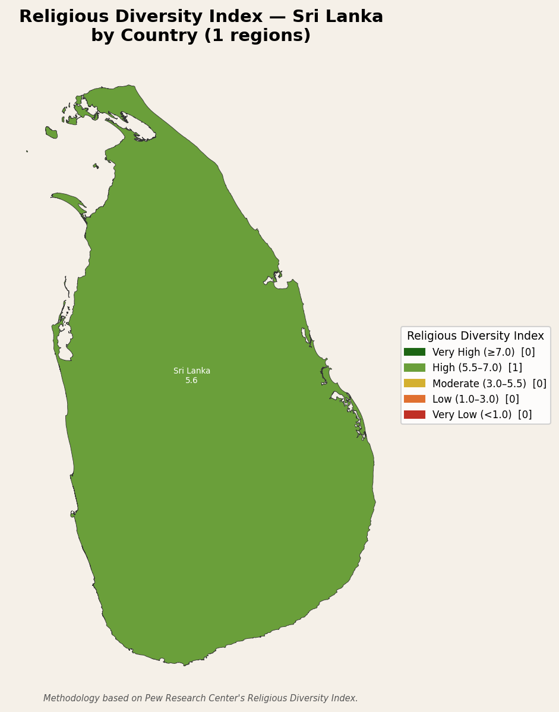
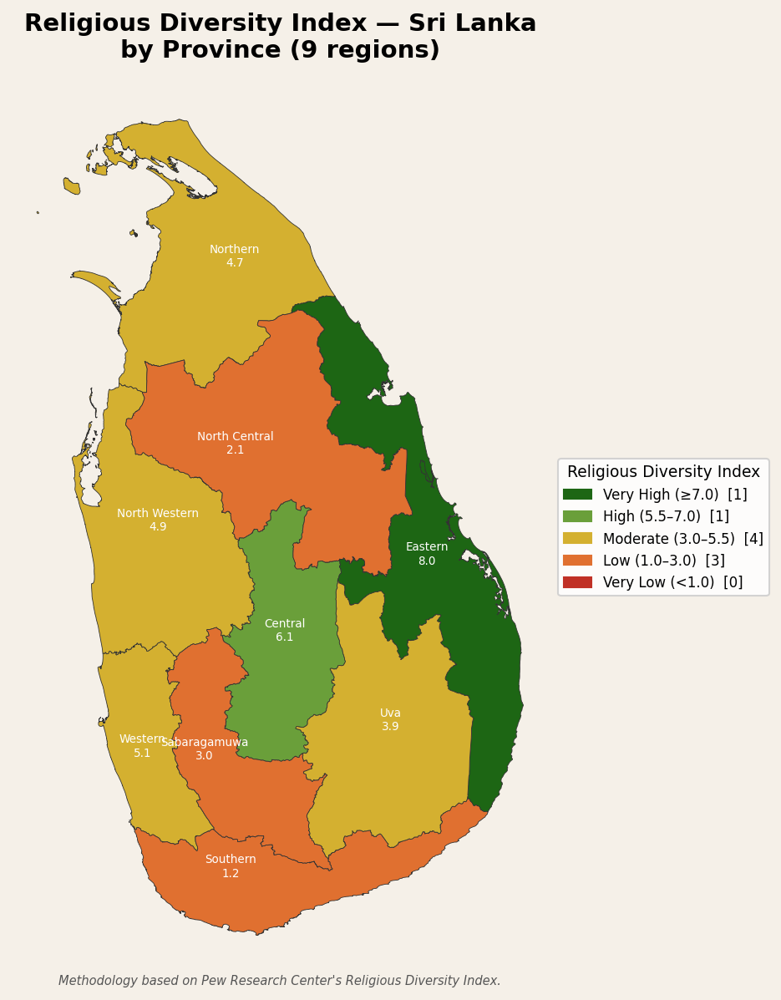
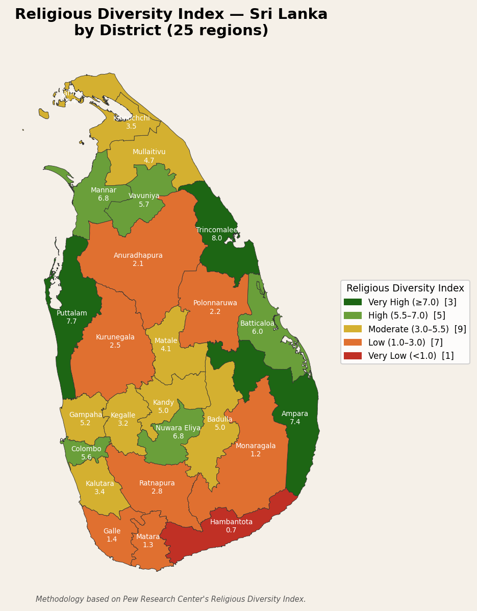
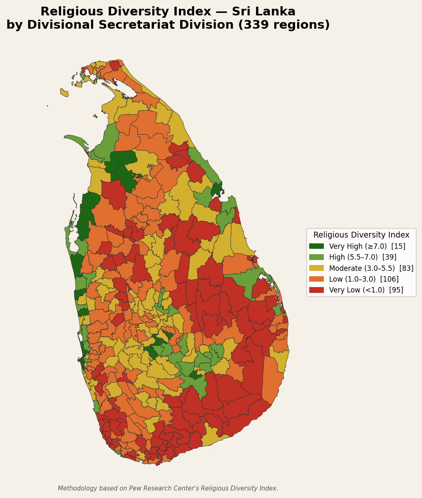

# One Island, Many Maps: The Hidden Geography of Religious Diversity in Sri Lanka

### Pew Research ranks Sri Lanka 39th in the world for religious diversity. But that single number conceals a country of extraordinary contrasts — from districts that rival the world's most pluralist places to corners that are almost entirely monocultural

---

## Why This Matters

In February 2026 the Pew Research Center published its updated [Religious Diversity Index](https://www.pewresearch.org/religion/2026/02/12/religious-diversity-around-the-world/), ranking 198 countries by how evenly their populations are spread across eight major faith traditions. Sri Lanka — a country of 22 million people and four major religions — earned a score of **5.6 out of 10**, placing it in the "High" diversity band alongside nations like Singapore and Switzerland.

A single national score, however, is an aggregation over an island that is anything but average. Sri Lanka's ethnic and religious communities are not randomly distributed; they are geographically concentrated in patterns shaped by centuries of history, colonial policy, and one of Asia's longest civil wars. This analysis breaks the national RDI down to province, district, and sub-region levels using Sri Lanka's 2024 Census of Population and Housing, asking a simple question: *where* is Sri Lanka diverse, and where is it not?

---

## The Metric: How the RDI Is Computed

The Religious Diversity Index uses the **Herfindahl-Simpson concentration measure** — the same statistic used in economics to measure market concentration — applied to religious population shares. Intuitively, it answers the question: *if you picked two Sri Lankans at random, what is the probability they belong to different faiths?*

For a region with population shares $s_1, s_2, \ldots, s_n$ across $n$ faith categories:

$$\text{RDI} = \frac{10 \times (1 - \sum s_i^2)}{1 - \frac{1}{n}}$$

The denominator $1 - \frac{1}{n}$ rescales the result so that a perfectly even split across all $n$ categories yields exactly 10, regardless of how many categories are used. The sum $\sum s_i^2$ is the probability that two randomly chosen people share the same faith; subtracting it from 1 gives the probability they differ.

**Walking through Sri Lanka as a whole** (5 census categories: Buddhist, Hindu, Muslim, Christian, Other):

| Religion | Share | $s_i^2$ |
|---|---|---|
| Buddhist | 70.2% | 0.4928 |
| Hindu | 12.6% | 0.0159 |
| Muslim | 9.7% | 0.0094 |
| Christian | 7.4% | 0.0055 |
| Other | 0.1% | 0.0000 |
| **Total** | | **0.5236** |

$$\text{RDI} = \frac{10 \times (1 - 0.5236)}{1 - \frac{1}{5}} = \frac{10 \times 0.4764}{0.8} = \mathbf{5.6}$$

This matches Pew's published figure precisely. The country earns its "High" rating because no single group is completely dominant — Buddhists form a strong majority, but a meaningful quarter of the population belongs to three other traditions.

---

## Provinces: A Country of Extremes

The provincial map immediately dissolves the illusion of a uniformly diverse nation.

**Eastern Province (8.0 — Very High)** is the most religiously diverse province in Sri Lanka by a significant margin. Its population is roughly divided three ways between Sinhalese Buddhists, Sri Lankan Tamils (Hindu), and Sri Lankan Muslims — a three-community balance that pushes the index close to its theoretical maximum. No single group holds more than about 40% of the population.

**Central Province (6.1 — High)** owes much of its diversity to the Indian Tamil plantation community brought by the British to work the tea estates of Nuwara Eliya and Kandy. These communities are predominantly Hindu, creating a significant counterweight to the Sinhalese Buddhist majority in the hill country.

**Southern Province (1.2 — Low)** sits at the opposite extreme. It is one of the most homogeneously Sinhalese Buddhist regions in the country. The south coast — Galle, Matara, Hambantota — has historically had limited settlement by Tamil or Muslim communities, a pattern reinforced over generations. The province's score of 1.2 places it just above the "Very Low" threshold.

**North Central Province (2.1 — Low)** tells a different story of low diversity. Ancient Sinhalese Buddhist heartland centred on Anuradhapura, it scores low not because of historical isolation but because it is overwhelmingly Buddhist. Post-war resettlement has brought some demographic change, but the 2024 census still captures a region with a single community in strong majority.

---

## Districts: Where the Diversity Lives

The district map reveals sub-provincial patterns that the provincial view obscures.

**Trincomalee (8.0)** and **Ampara (7.4)** are the standout Very High districts — both on the east coast, both the product of historically interleaved Muslim, Tamil, and Sinhalese settlement. Trincomalee's famous natural harbour attracted traders and colonisers of every background; today that history is written in its demographics.

**Puttalam (7.7)** in the North Western Province is a surprise entry in the Very High band. Its large Sri Lankan Moor (Muslim) community, concentrated in coastal fishing towns, sits alongside a Sinhalese Buddhist hinterland. The resulting balance produces one of the highest district scores outside the east.

**Nuwara Eliya (6.8)** and **Mannar (6.8)** both score High. Nuwara Eliya is the heart of the estate Tamil community — in some divisions Indian Tamils are the majority, making it the most ethnically complex district in the hill country. Mannar, a small and historically significant island-linked district in the north-west, has a large Catholic Tamil population alongside Muslims and Sinhalese, a legacy of Portuguese missionary activity.

**Hambantota (0.7)** is the only district to fall into the Very Low band — the single red district on the map. Over 95% of its population is Sinhalese Buddhist. The contrast with Trincomalee, just two provinces away on the same island, is a measure of how profoundly geography has shaped community composition.

---

## A Note on the DSD Level

At the Divisional Secretariat level — over 300 administrative units — the variation becomes even starker. Many DSDs along the east coast and in the hill country plantation belt remain Very High, while large swathes of the south, north-central, and parts of the Western Province dry zone appear as solid orange and red. The finer the lens, the more clearly Sri Lanka's communities resolve into distinct geographic concentrations.

---

## Caveats: What the Index Does Not Tell You

The RDI is a useful summary statistic, but it has genuine weaknesses — and Sri Lanka provides vivid illustrations of each.

**High diversity does not mean peaceful coexistence.** Eastern Province scores 8.0 — the highest in the country — yet the east was also one of the most heavily contested theatres of Sri Lanka's thirty-year civil war. Trincomalee and Ampara districts experienced some of the worst inter-communal violence of the 1980s. The index measures how mixed a population is, not how harmoniously it lives together. A score of 8.0 could describe a genuinely integrated community or a patchwork of segregated enclaves occupying the same district.

**The index is scale-sensitive.** A district that scores "Moderate" may contain GN divisions that are almost entirely composed of a single community living alongside other GN divisions of a different community. The diversity registered at district level is partly an artefact of drawing a boundary around two adjacent monocultural villages. This effect is visible when comparing the district and DSD maps: several districts that appear moderate at the district level show a mosaic of Very High and Very Low at the DSD level.

**Treating the 2024 baseline as fixed.** The 2024 census was the 2nd conducted across all of Sri Lanka following the end of the civil war in 2009. Large-scale displacement and post-war resettlement in the north and east mean the demographic landscape in those regions could still be in flux. Districts like Mullaitivu (4.7) and Kilinochchi (3.5) had seen massive population movements in the preceding decade; their 2024 figures reflect a transitional moment rather than a settled pattern.

**Near-zero categories inflate the score under normalisation.** Because the formula divides by $1 - 1/n$, adding a category that is nearly empty (like "Jews" or "religiously unaffiliated" in Sri Lanka) still increases $n$ and therefore the denominator. This effectively raises every region's score slightly relative to a 4-category formulation. This analysis uses $n = 5$ census categories; Pew's global analysis uses $n = 7$, which is part of why direct score comparisons require care.

**The index treats all groups symmetrically regardless of size.** A district split 50/50 between two groups scores identically to one split 50/50 between two different groups, regardless of the social or political significance of those groups. In Sri Lanka, where ethnicity, language, and religion are deeply intertwined, a Buddhist-Muslim balance carries different social weight than a Buddhist-Christian balance would in another context — distinctions the index cannot capture.

---

*Data: Sri Lanka Census of Population and Housing, 2024. Methodology follows the Pew Research Center's Religious Diversity Index. Analysis and maps produced using Python, GeoPandas, and Matplotlib.*
